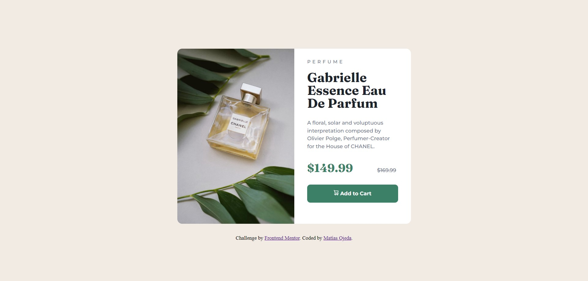
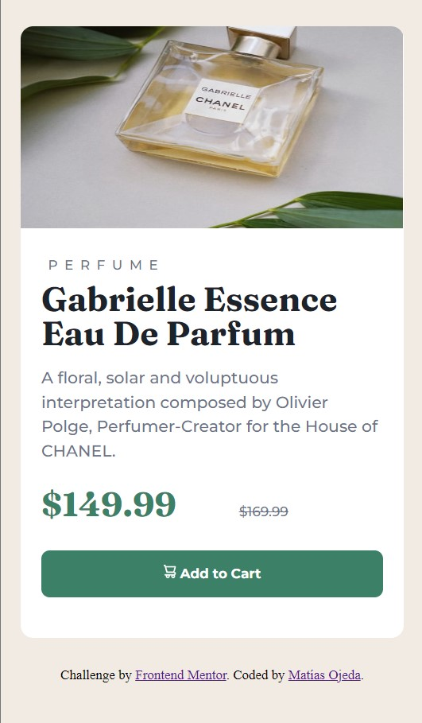

# Frontend Mentor - Product preview card component solution

This is a solution to the [Product preview card component challenge on Frontend Mentor](https://www.frontendmentor.io/challenges/product-preview-card-component-GO7UmttRfa). Frontend Mentor challenges help you improve your coding skills by building realistic projects. 

## Table of contents

- [Overview](#overview)
  - [The challenge](#the-challenge)
  - [Screenshot](#screenshot)
  - [Links](#links)
- [My process](#my-process)
  - [Built with](#built-with)
  - [What I learned](#what-i-learned)
  - [Continued development](#continued-development)
  - [Useful resources](#useful-resources)
- [Author](#author)
- [Acknowledgments](#acknowledgments)

**Note: Delete this note and update the table of contents based on what sections you keep.**

## Overview

### The challenge

Users should be able to:

- View the optimal layout depending on their device's screen size
- See hover and focus states for interactive elements

### Screenshot




### Links

- Solution URL: [Add solution URL here](https://sdmatias.github.io/product-preview-card-component/)
- Live Site URL: [Add live site URL here](https://your-live-site-url.com)

## My process

My process was first to write the HTML code with the corresponding semantics, then create the styles for mobile devices and finally with a media query I made the design for larger devices.

### Built with

- Semantic HTML5 markup
- CSS custom properties
- Flexbox

### What I learned

In this challenge I learned a new and modern way to reset CSS margins. Also the importance of mobile first design.

```css
*,
*::before,
*::after {
    box-sizing: border-box;
}

body,
main,
img,
p,
h1,
span,
del,
button,
svg,
footer {
    margin: 0;
}

html:focus-within {
    scroll-behavior: smooth;
}

body {
    min-height: 100vh !important;
    text-rendering: optimizeSpeed;
    line-height: 1.5;
}

img {
    max-width: 100%;
    display: block;
}

button {
    font: inherit;
}
```

### Continued development

I want to continue strengthening my design skills for different screen sizes. I'm still not comfortable with that part of the design and it's taking longer than I expect.

### Useful resources

- [CSS Reset](https://andy-bell.co.uk/a-modern-css-reset/) - This article helped me change my outdated CSS margin reset to a more modern one.
- [Uso correcto de ID attribute](https://fedmentor.dev/posts/id-attribute-masterclass/) - Here I found help to understand the correct use of IDs in HTML.

## Author

- Website - [Support Device - Matías](https://sprtdevice.blogspot.com/)
- Frontend Mentor - [@sdmatias](https://www.frontendmentor.io/profile/sdmatias)
- Twitter - [@sprtdevice](https://www.twitter.com/sprtdevice)

## Acknowledgments

Thanks to the Slack community for helping me to complete this challenge.
